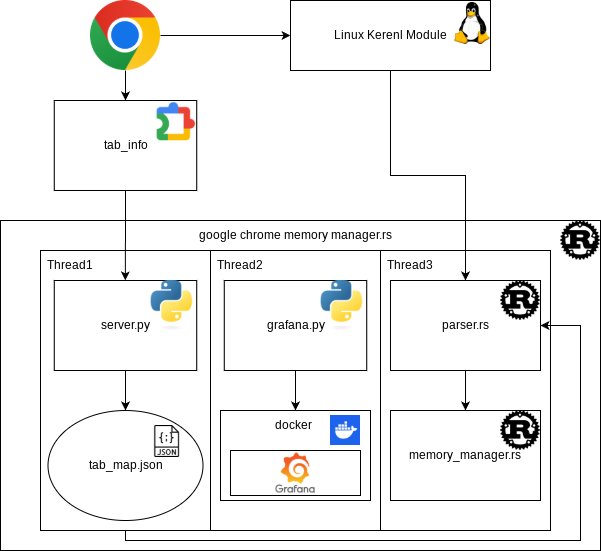
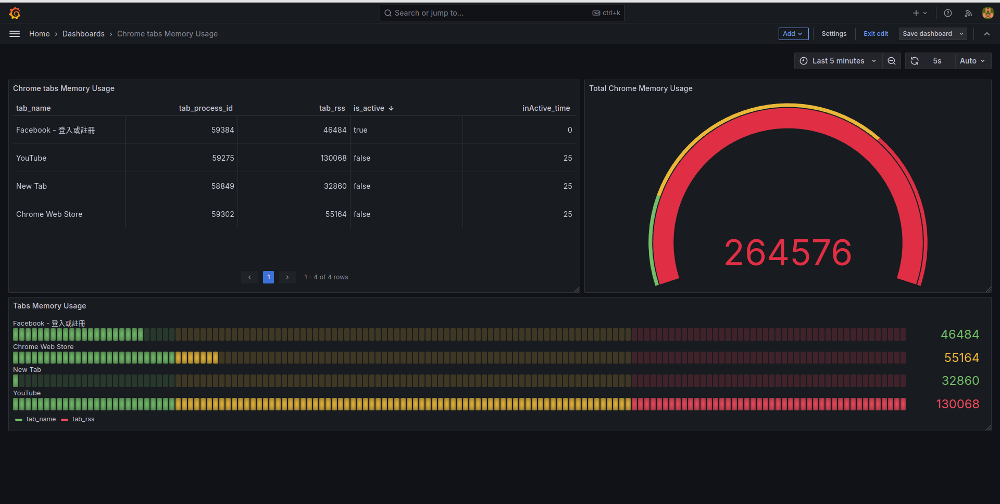

## Google Chrome Memory Manager
A memory management strategy more aggressive than Google Chrome's native memory management mechanism.

Users can configure related options in manager.toml, such as Chrome's maximum memory usage, the idle time threshold for removing tabs, and the memory management strategy to use. By setting these parameters, users can decide how the Google Chrome Memory Manager handles memory associated with tabs.



For tab memory management strategies, there are two approaches:

RSS Limit Strategy
When the memory usage reaches the user-specified rss_limit, the manager releases memory from tabs (excluding the foreground tab) starting with the ones consuming the most memory, until the total memory usage falls below the rss_limit.

Idle Time Strategy
Based on the user-defined idle time, the manager evaluates the memory usage changes of each tab. Tabs that show no significant memory usage variation within the idle_time and are not in the foreground are considered idle and have their resources released.

## Dependencies

- flask

- jsonpath-ng

## Usage
This project relies on a Google Chrome extension (Chrome must support manifestV3 and getProcessIdForTab) and a kernel module to gather process data related to Chrome.

After loading the Google Chrome extension, start the Google Chrome Memory Manager with the following command:

```shell
$ make
```

The project supports a Grafana visualization dashboard. After installing Grafana, load the grafana/template.json file to view the memory usage of each Chrome tab, as shown in the example below.

